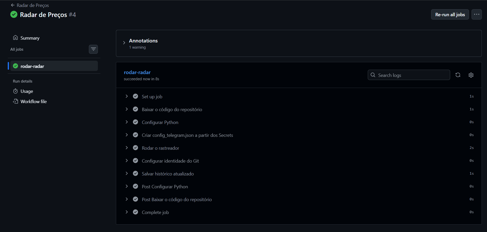

<div align="center">

# 🎮 Steam Price Tracker

**Automatic Steam game price radar — no more manual price checking.**

[🇧🇷 Português](README.md) · [🇺🇸 English](README.en.md)


</div>

---

## 📌 The problem

Manually checking Steam for game discounts is tedious and easy to forget — sales come and go without you noticing. This project automates that: it checks prices for you and only notifies you when something relevant happens.

## ⚙️ Features

- 🔎 Fetches the current price of any Steam game by its `app_id`
- 🕵️ Compares against history and detects a price **drop**, **increase**, or **no change**
- 📉 Tracks the **lowest price ever seen** for each game, included in drop alerts
- 📲 Sends **Telegram notifications** automatically on price drops or increases
- 🗂️ Configurable list of monitored games, no code editing required
- 🧾 Persistent execution logging via `logging` (useful for debugging and future automation)
- 💾 Price history organized per game in `historico.json`

## 🖥️ How to run

**1. Prerequisite:** [Python](https://www.python.org/downloads/) installed. No external libraries required — the project only uses the standard library (`urllib`, `json`, `logging`).

**2. Clone the repository**
```bash
git clone https://github.com/pietrobitencourt/steam-price-tracker
cd steam-price-tracker
```

**3. Configure the games you want to track**

Create a `jogos_monitorados.json` file with the desired `app_ids` (found in the game's Steam store URL):
```json
[413150, 730, 570]
```

**4. (Optional) Set up Telegram notifications**

- Create a bot by messaging [@BotFather](https://t.me/BotFather) on Telegram and grab the generated token.
- Find your `chat_id` by messaging your bot and visiting `https://api.telegram.org/bot<TOKEN>/getUpdates`.
- Create a `config_telegram.json` file:
```json
{
    "token": "YOUR_TOKEN_HERE",
    "chat_id": YOUR_CHAT_ID_HERE
}
```

**5. Run it**
```bash
python rastreador_precos.py
```

## 🧰 Tech stack

| Technology | Purpose |
|---|---|
| Python (stdlib) | Core logic, zero external dependencies |
| `urllib` | HTTP requests (Steam API and Telegram) |
| `json` | Structured data reading/writing |
| `logging` | Persistent execution logging |
| Telegram Bot API | Real-time notifications |
| Git & GitHub | Version control |

## 🗺️ Roadmap

- [x] Price lookup via Steam's public API
- [x] Persistent JSON history
- [x] Price drop/increase detection
- [x] Configurable monitored games list
- [x] Telegram notifications
- [x] Lowest price ever seen
- [x] Persistent logging
- [x] History restructured per game
- [x] Automated scheduled execution (via GitHub Actions)
- [x] Interactive local menu to add/remove games
- [x] Telegram chat commands (add, remove, and list games directly via the bot)

## 📸 Demo

The program running and the notification arriving in real time:


The Telegram notification, detecting a price drop:


The automation running on its own in the cloud, via GitHub Actions:



## 👤 Author

**Piêtro Bitencourt Nunes**
[github.com/pietrobitencourt](https://github.com/pietrobitencourt)