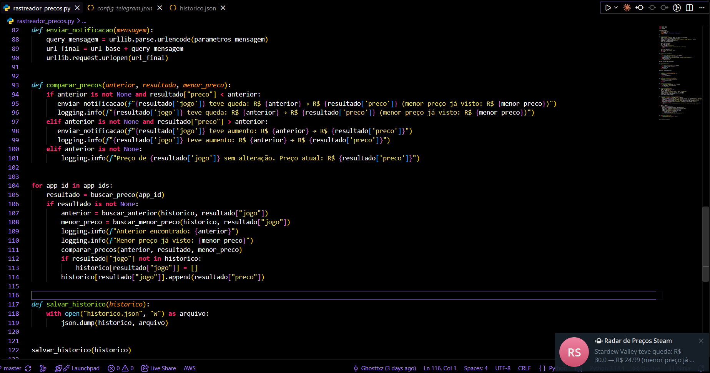
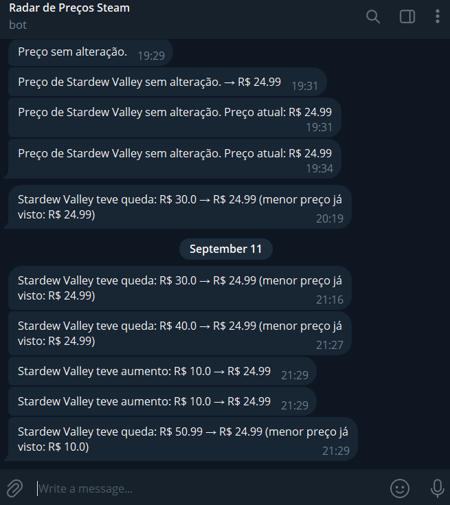

<div align="center">

# 🎮 Steam Price Tracker

**Radar automático de preços de jogos da Steam — sem precisar checar manualmente.**

[🇧🇷 Português](README.md) · [🇺🇸 English](README.en.md)


</div>

---

## 📌 O problema

Acompanhar promoções de jogos na Steam manualmente é chato e fácil de esquecer — a promoção passa e você nem fica sabendo. Este projeto automatiza isso: ele verifica os preços por você e só te avisa quando *algo relevante* acontece.

## ⚙️ Funcionalidades

- 🔎 Busca o preço atual de qualquer jogo da Steam pelo seu `app_id`
- 🕵️ Compara com o histórico e detecta **queda**, **aumento** ou preço **estável**
- 📉 Mostra o **menor preço já visto** de cada jogo, junto com alertas de queda
- 📲 Envia **notificação via Telegram** automaticamente quando o preço cai ou sobe
- 🗂️ Lista de jogos monitorados configurável, sem precisar editar código
- 🧾 Registro persistente de execução via `logging` (útil para depuração e automação futura)
- 💾 Histórico organizado por jogo em `historico.json`

## 🖥️ Como executar

**1. Pré-requisito:** ter o [Python](https://www.python.org/downloads/) instalado. Não é necessário instalar nenhuma biblioteca externa — o projeto usa só bibliotecas padrão (`urllib`, `json`, `logging`).

**2. Clone o repositório**
```bash
git clone https://github.com/pietrobitencourt/steam-price-tracker
cd steam-price-tracker
```

**3. Configure os jogos que você quer acompanhar**

Crie um arquivo `jogos_monitorados.json` com os `app_ids` desejados (encontrados na URL da página do jogo na Steam):
```json
[413150, 730, 570]
```

**4. (Opcional) Configure notificações via Telegram**

- Crie um bot conversando com [@BotFather](https://t.me/BotFather) no Telegram e pegue o token gerado.
- Descubra seu `chat_id` enviando uma mensagem ao seu bot e acessando `https://api.telegram.org/bot<TOKEN>/getUpdates`.
- Crie um arquivo `config_telegram.json`:
```json
{
    "token": "SEU_TOKEN_AQUI",
    "chat_id": SEU_CHAT_ID_AQUI
}
```

**5. Execute**
```bash
python rastreador_precos.py
```

## 🧰 Tecnologias

| Tecnologia | Uso |
|---|---|
| Python (stdlib) | Lógica principal, sem dependências externas |
| `urllib` | Requisições HTTP (API da Steam e Telegram) |
| `json` | Leitura/escrita de dados estruturados |
| `logging` | Registro persistente de execução |
| Telegram Bot API | Notificações em tempo real |
| Git & GitHub | Controle de versão |

## 🗺️ Roadmap

- [x] Busca de preço via API pública da Steam
- [x] Histórico persistente em JSON
- [x] Detecção de queda/aumento de preço
- [x] Lista de jogos monitorados configurável
- [x] Notificações via Telegram
- [x] Menor preço histórico
- [x] Logging persistente
- [x] Histórico reestruturado por jogo
- [x] Automação de execução (rodar sozinho periodicamente, via GitHub Actions)
- [x] Menu local interativo para adicionar/remover jogos
- [x] Comandos via chat do Telegram (adicionar, remover e listar jogos direto pelo bot)

## 📸 Demonstração

O programa rodando e a notificação chegando em tempo real:



A notificação no Telegram, detectando uma queda de preço:



## 👤 Autor

**Pietro Bitencourt**
[github.com/pietrobitencourt](https://github.com/pietrobitencourt)